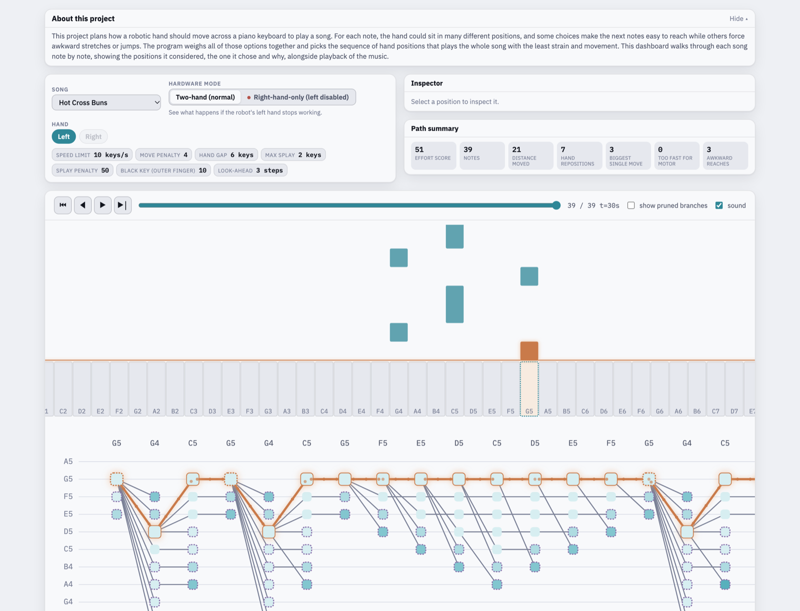

# Piano Hand Trellis

**Teaching a robotic hand where to sit on a piano keyboard so it can play a whole song smoothly.**



## What this is

This project plans how a robotic hand should move across a piano keyboard to
play a song. For each note, the hand could sit in many different positions,
and some choices make the next notes easy to reach while others force awkward
stretches or jumps. The program weighs all of those options together and picks
the sequence of hand positions that plays the whole song with the least strain
and movement.

The included **dashboard** walks through each song note by note, showing the
positions the program considered, the one it chose and why, alongside playback
of the music.

## Why it's harder than it looks

A hand can only cover about an octave at once, a robot can only move so fast,
and every note has to be reachable at the exact moment it's played. The
choice that looks easiest for *this* note can leave the hand stranded for the
next few. So the program can't just pick the best spot one note at a time. It
has to plan the whole song at once.

Checking every possible plan would take longer than the age of the universe.
Instead, the program uses a classic shortcut (the *Viterbi algorithm*, the same
idea behind GPS route-finding and speech recognition) that finds the best plan
in well under a second.

**Want the full story without any code?** Read
[How this works](ALGORITHM.md). It's a plain-language walkthrough built
around a road-trip analogy.

## What the dashboard shows

| Part of the screen | What it tells you |
| --- | --- |
| **Song and hardware mode** | Pick any of 61 songs. Switch to *right-hand-only* to see what happens if the robot's left hand stops working. |
| **Path summary** | The final score for the chosen plan: how far the hand moved, how many times it repositioned, and how many stretches were awkward. |
| **Piano roll** | Notes fall onto the keyboard in time with the music, with sound. |
| **Decision map** (bottom) | Every possible hand position at every note. The **orange line** is the plan the program chose. Click any position to see why it was or wasn't picked. |

The 61 songs include six familiar pieces (Hot Cross Buns, Happy Birthday,
Twinkle Twinkle Little Star, Mary Had a Little Lamb, the Star-Spangled Banner
and Fuyu no Hanashi) plus short exercises chosen to test the program: fast
scales, big leaps, arpeggios and tricky black-key passages.

## Try it yourself

You need a Mac, Windows or Linux computer with
[Python 3](https://www.python.org/downloads/) installed. Nothing else.

1. Download this project: click the green **Code** button at the top of this
   page, then **Download ZIP**, and unzip it.
2. Open a terminal (on a Mac, search Spotlight for *Terminal*) and go into the
   `dashboard` folder inside the project, for example:
   ```
   cd ~/Downloads/piano-hand-trellis-main/dashboard
   ```
3. Start a small local web server:
   ```
   python3 -m http.server 8000
   ```
4. Open **http://localhost:8000/** in your web browser and click
   **Enter dashboard**.

To stop the server, go back to the terminal and press `Ctrl + C`.

## What's in this project

| Folder or file | What it is |
| --- | --- |
| `dashboard/` | The interactive dashboard you see above. |
| `ALGORITHM.md` | A plain-language explanation of how the program decides. |
| `findOptimalHandPos.py` | The program itself: reads sheet music and plans the hand's movements. |
| `inputs/` | Sheet music for the six main songs. |
| `outputs/` | The notes of every song, converted into the format the program reads. |
| `output_rh_only/` | Example results for the right-hand-only scenario. |
| `docs/` | The screenshot above and the [developer guide](docs/DEVELOPERS.md). |

## For developers

Setup, regenerating the dashboard data, command-line options and the
verification script are covered in the [developer guide](docs/DEVELOPERS.md).
